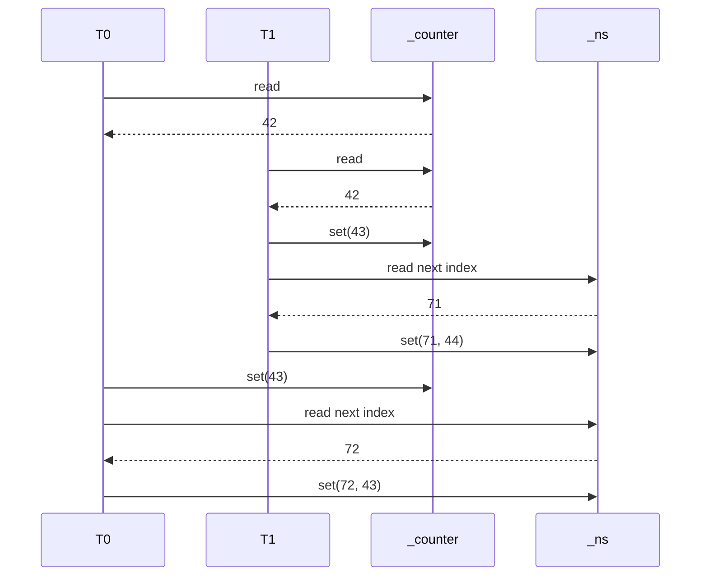
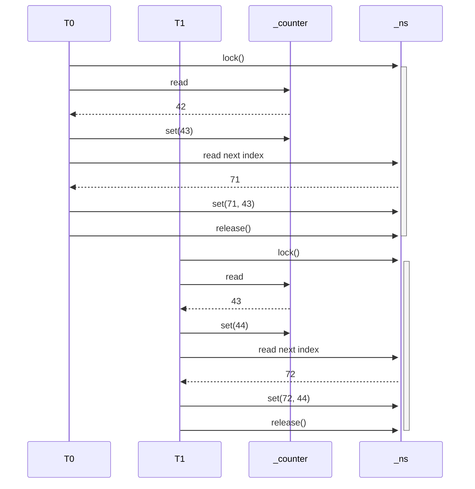

# A Parallel Sequence Generator #

Two threads are trying to construct a sequence of numbers, going from 1 to n.

## A ##

A very naive implementation. The two threads do not synchronize. Therefore, we have a race condition.

## B ##

An attempt at synchronizing; notice that `_current` is marked as `volatile`. But the code in `Next()` performs a non-atomic check-then-act sequence, and updates are lost.

## C ##

An implementation using the `lock` keyword on `_ns`. This corrects both, the missing synchronization as well as the non-atomic check-then-act sequence.

